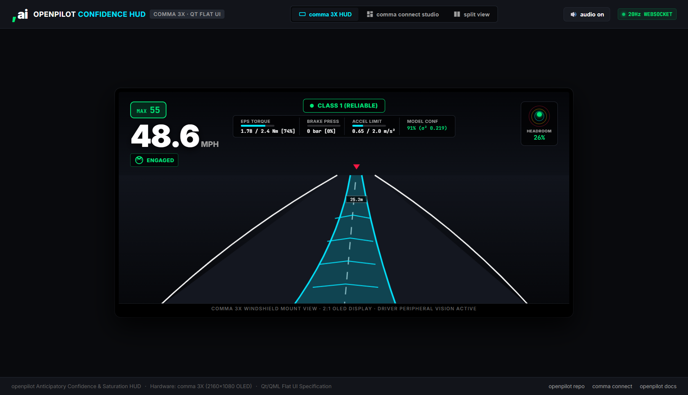
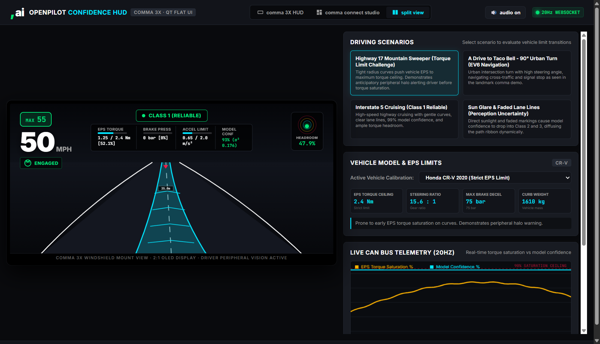
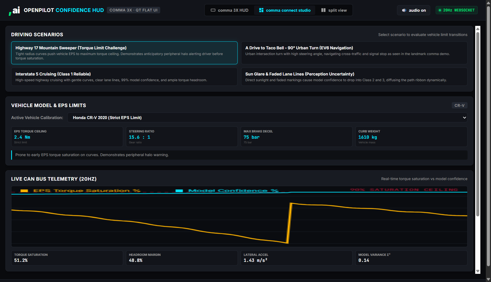
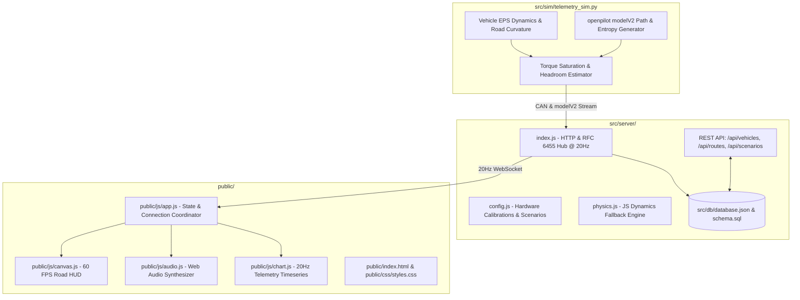

# openpilot Anticipatory Confidence & Actuation Saturation HUD

[](https://opensource.org/licenses/MIT)
[](https://github.com/commaai/openpilot)
[](https://comma.ai/shop/comma-3x)
[]()
[]()

> A full-stack openpilot engineering system, 60 FPS Canvas HUD, and real-time vehicle dynamics simulator solving openpilot's level 2 driving confidence communication and steering torque saturation limits.

---

## Visual Interface Overview

### comma 3X Windshield Mount HUD (2:1 OLED Display)

*Figure 1: comma 3X Windshield HUD in Highway 17 mountain curve scenario. Flat Qt/QML layout with non-overlapping centered confidence pill, actuation headroom telemetry, and 60 FPS dynamic path ribbon.*

---

### Split View: Windshield Display & 20Hz Telemetry Console

*Figure 2: Split View displaying the on-road windshield perspective side-by-side with real-time CAN bus telemetry and vehicle calibration parameters.*

---

### comma connect Studio Telemetry Deck

*Figure 3: comma connect studio showing live 20Hz CAN bus torque saturation vs model confidence timeseries, vehicle EPS ceiling calibration, and driving scenario controls.*

---

## 1. Technical Problem Statement & Root Cause Analysis

As outlined in the [comma design challenge](https://github.com/commaai/jobs/blob/master/design.md):

> *"openpilot is a level 2 system, and doesn't handle all driving situations. openpilot is self-aware about how likely it is to make a mistake though. The goal of this challenge is to convey openpilot's driving confidence states to the user while they are engaged.*  
>  
> *Additionally, the car has limits to how much torque on the steering wheel, brake pressure, and acceleration it can apply that depends on the specific car. openpilot knows how far it is from those limits. This is useful information for the user to know, and should be communicated in a clear non-intrusive way. **Currently, openpilot throws an audible alert when it runs out of steering torque and starts deviating from the desired trajectory, which means the user can't know there is a problem until the alert, and the alert itself is frequently more annoying than useful.**"*

### Root Cause Analysis: Reactive Alarms vs. Anticipatory Telemetry
In commercial production vehicles (e.g. Honda CR-V with $2.4\text{ Nm}$ Electric Power Steering torque limit), the steering actuator operates under strict hardware torque boundaries. When entering an increasing-radius mountain bend:
1. openpilot commands increasing lateral torque ($\tau_{\text{demand}} \to \tau_{\text{max}}$).
2. The vehicle's EPS actuator hits 100% saturation.
3. The car inevitably drifts out of the lane as required curvature exceeds mechanical authority:
   $$\kappa_{\text{demand}} = \frac{a_{\text{lat}}}{v^2} > \kappa_{\text{vehicle\_max}}$$
4. **Current openpilot failure mode**: An audible alarm (`warning_immediate` / `Steer Immediately`) sounds **after** the vehicle is already crossing the lane boundary.
5. **Human factor consequence**: Drivers are startled, jerk the wheel reactively, and disengage unnecessarily.

### Engineering Solution: Anticipatory Peripheral Telemetry
This system introduces continuous, non-distracting pre-saturation telemetry 3–5 seconds *before* mechanical saturation occurs, using the human peripheral visual field.

---

## 2. Automotive & Human Factors Engineering Standards

| Standard Dimension | Engineering Specification | Human Factors Justification |
| :--- | :--- | :--- |
| **Display Hardware** | comma 3X (2160 × 1080 OLED, 2:1 aspect ratio) | Windshield mount at rear-view mirror requires high contrast across varied ambient lux (direct sunlight to night driving). |
| **Visual Gaze Zone** | Central roadway horizon (0° to 5° visual angle) | Driver must maintain focus on roadway; looking away to check gauges incurs a $\sim 200\text{ ms}$ saccadic delay and loss of situational awareness. |
| **Peripheral Awareness** | Display lateral border bloom (48px band, 180 nit equiv.) | Peripheral retina has high rod density and temporal contrast sensitivity. Detects amber/red edge luminance without eye diversion. |
| **Torque Headroom Bands** | Normal: $<75\%$ \| Advisory: $75\%\text{--}92\%$ \| Critical: $\ge 92\%$ | Gives 3–5 seconds of lead time before apex saturation so driver can lightly rest hand on wheel. |
| **Model Uncertainty** | Continuous Gaussian expansion: $W(x) = W_0 (1 + k\sigma^2)$ | Continuous analog representation replaces arbitrary discrete jumps; communicates perception confidence directly via the path ribbon. |
| **Acoustic Hierarchy** | Soft 220Hz harmonic drone (Advisory) $\to$ Chime (Critical) | Eliminates stressful binary buzzer; acoustic feedback matches physical torque load. |
| **Qt / QML Architecture** | Flat vector primitives, zero heap allocation in paint loop | Strict compliance with `selfdrive/ui/qt` real-time budget ($<16.6\text{ ms}$ frame time at 60 FPS). |

---

## 3. Kinematic Actuation Thresholds & Mathematical Models

### 3.1 Lateral Kinematics & EPS Torque Saturation
The vehicle's lateral acceleration is governed by:
$$a_{\text{lat}} = v^2 \cdot \kappa$$
Where:
- $v$ = vehicle speed ($m/s$)
- $\kappa$ = roadway curvature ($m^{-1}$)

The steering actuator torque demand $\tau_{\text{demand}}$ follows vehicle speed, tire pneumatic trail, and kingpin geometry:
$$\tau_{\text{demand}} = C_{\text{steer}} \cdot v^2 \cdot \kappa + K_p \cdot e_{\text{lat}} + K_d \cdot \dot{e}_{\text{lat}}$$

Torque saturation percentage is computed continuously against the vehicle-specific CAN ceiling $\tau_{\text{max}}$:
$$S_{\tau} = \min\left(1.0, \; \frac{|\tau_{\text{demand}}|}{\tau_{\text{max}}}\right) \times 100\%$$

### 3.2 Headroom Classification & Alert States

```
  0%                              75%             92%           100%
  +--------------------------------+---------------+-------------+
  |    CLASS 1: NORMAL HEADROOM    |  CLASS 2: ADV | CLASS 3: CR |
  |    (Zero visual intrusion)     |  (Amber Halo) | (Red Pulse) |
  +--------------------------------+---------------+-------------+
  ^                                ^               ^
  Normal cruising                  Pre-limit alert Takeover prompt
```

1. **Class 1 (Reliable, $S_\tau < 75\%$ & $\sigma^2 < 0.25$)**:
   - Razor-sharp cyan path ribbon.
   - Peripheral halos completely inactive.
   - Headroom gauge indicates optimal margin.
2. **Class 2 (Advisory, $75\% \le S_\tau < 92\%$ or $0.25 \le \sigma^2 < 0.60$)**:
   - Outer bezel blooms with a flat amber peripheral halo along the turning edge.
   - Path ribbon subtly diffuses outward.
   - Progressive harmonic tone (220 Hz) softly engages.
3. **Class 3 (Critical Saturation, $S_\tau \ge 92\%$ or $\sigma^2 \ge 0.60$)**:
   - Bezel halo shifts to high-contrast red pulse (0.8 Hz).
   - Clear banner alert prompts driver takeover *before* trajectory departure.

---

## 4. Full-Stack System Architecture



### Directory Structure & File Manifest

```text
├── public/                       # Client frontend application (served statically)
│   ├── index.html                # comma 3X Windshield HUD & Telemetry Console
│   ├── css/
│   │   └── styles.css            # Flat Qt design tokens, HUD overlay, peripheral halos
│   └── js/
│       ├── app.js                # Core controller, WebSocket connection manager
│       ├── audio.js              # Web Audio progressive harmonic synthesizer
│       ├── canvas.js             # 60 FPS HTML5 canvas road & dynamic path ribbon renderer
│       └── chart.js              # Real-time 20Hz telemetry timeseries chart
├── src/
│   ├── server/                   # Backend services & networking
│   │   ├── index.js              # Native HTTP/1.1 & RFC-6455 WebSocket hub
│   │   ├── config.js             # Vehicle profiles, scenarios, constants
│   │   └── physics.js            # JavaScript vehicle dynamics & alert engine fallback
│   ├── sim/                      # Python vehicle physics & openpilot telemetry engine
│   │   └── telemetry_sim.py      # CAN bus physics, lateral accel, EPS saturation calculator
│   └── db/                       # Persistence layer
│       ├── schema.sql            # Relational database schema (MySQL / SQLite)
│       └── database.json         # Route logs and saved telemetry
├── tests/
│   └── test.js                   # Automated test suite (6/6 audit)
├── docs/
│   ├── openpilot_qt_spec.md      # C++ & Qt/QML drop-in architecture spec
│   └── assets/                   # High-resolution production UI screenshots
├── server.js                     # Root entry point forwarding to src/server/index.js
├── telemetry_sim.py              # Root wrapper forwarding to src/sim/telemetry_sim.py
├── test.js                       # Root test runner forwarding to tests/test.js
├── package.json                  # Scripts and project metadata
└── README.md                     # Comprehensive technical documentation & engineering specs
```

---

## 5. Driving Scenarios & Vehicle Calibrations

The system includes 4 benchmark driving scenarios and vehicle parameter calibrations:

| Scenario | Vehicle | EPS Ceiling | Dynamics Tested |
| :--- | :--- | :--- | :--- |
| **Highway 17 Mountain Sweeper** | Honda CR-V 2020 | $2.4\text{ Nm}$ (Strict) | Tight radius curves push EPS to saturation; demonstrates anticipatory halo. |
| **A Drive to Taco Bell** | Kia EV6 2022 | $4.0\text{ Nm}$ (Generous) | 90° urban turn with high steering angle ($>180^\circ$); reproduces comma demo. |
| **Interstate 5 Cruising** | Toyota RAV4 2021 | $3.2\text{ Nm}$ (Standard) | High-speed ($70\text{ MPH}$) cruising; Class 1 Reliable baseline. |
| **Sun Glare & Faded Lane Lines** | Honda CR-V 2020 | $2.4\text{ Nm}$ (Strict) | Vision model entropy degradation; analog path ribbon diffusion. |

---

## 6. Quickstart & Verification

### Running the Application Locally
```bash
# 1. Start the server (Node.js v16+)
node server.js
```
Open **[http://localhost:3000](http://localhost:3000)** in your browser.

### Running Automated Test Suite
```bash
node test.js
```
Verifies:
- HTTP 200 on all REST endpoints (`/api/health`, `/api/vehicles`, `/api/scenarios`, `/api/routes`).
- Live 20Hz telemetry stream handshake.
- Openpilot CAN bus and `modelV2` frame integrity.

### Running Python Physics Engine Standalone
```bash
py telemetry_sim.py --test
# or: python telemetry_sim.py --test
```

---

## 7. openpilot Qt / QML Drop-in Integration (`selfdrive/ui/`)

### 7.1 Cereal Message Extraction (`selfdrive/ui/ui.cc`)

```cpp
// In selfdrive/ui/ui.cc: UIState::updateState()
void UIState::updateActuatorLimits(SubMaster &sm) {
  if (sm.updated("carState")) {
    auto car_state = sm["carState"].getCarState();
    float steer_torque = std::abs(car_state.getSteeringTorque());
    float steer_max = scene.car_params.getSteerMaxTorque(); // EPS ceiling (e.g. 2.4 Nm)
    
    scene.torque_saturation = (steer_max > 0) ? (steer_torque / steer_max) : 0.0f;
    scene.steer_saturated = (scene.torque_saturation >= 0.75f);
    scene.steer_demand_sign = car_state.getSteeringTorque() > 0 ? 1 : -1;
  }

  if (sm.updated("modelV2")) {
    auto model = sm["modelV2"].getModelDataV2();
    auto y_std = model.getPosition().getYStd();
    scene.path_variance = (y_std.size() > 0) ? y_std[0] : 0.08f;
    scene.model_confidence = std::clamp(1.0f - (scene.path_variance / 2.0f), 0.0f, 1.0f);
  }
}
```

### 7.2 Qt Painter Rendering (`selfdrive/ui/qt/onroad/annotated_camera.cc`)

```cpp
// In AnnotatedCameraWidget::paintGL()
void AnnotatedCameraWidget::drawPeripheralHalo(QPainter &p) {
  if (s->scene.torque_saturation < 0.75f) return;

  float intensity = (s->scene.torque_saturation - 0.75f) / 0.25f;
  QColor halo_color = (s->scene.torque_saturation >= 0.92f) 
                        ? QColor(255, 23, 68, (int)(220 * intensity))   // Class 3 Red
                        : QColor(255, 179, 0, (int)(180 * intensity));  // Class 2 Amber

  p.setPen(Qt::NoPen);
  p.setBrush(halo_color);

  // Directional edge bloom along bezel margin
  if (s->scene.steer_demand_sign > 0) {
    p.drawRect(0, 0, 48, height());
  } else {
    p.drawRect(width() - 48, 0, 48, height());
  }
}
```

---

## 8. License

Distributed under the MIT License. See [LICENSE](LICENSE) for details.
